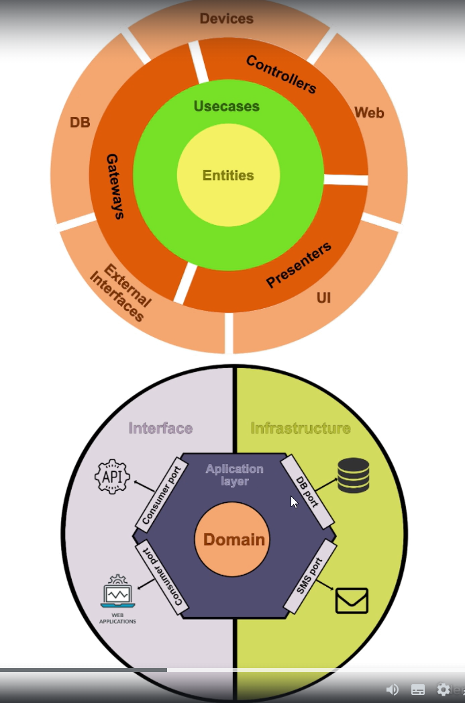
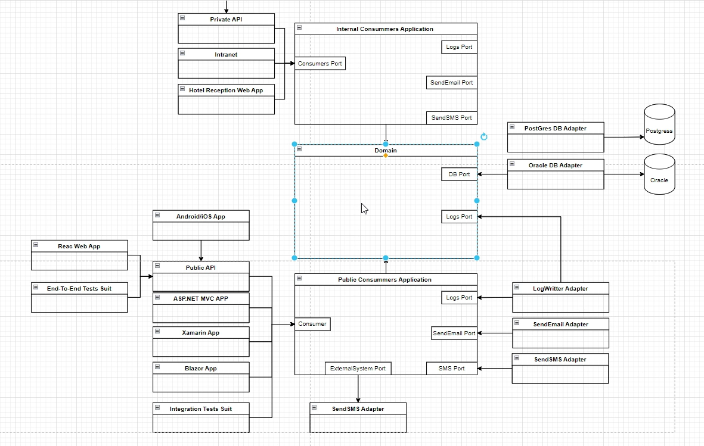
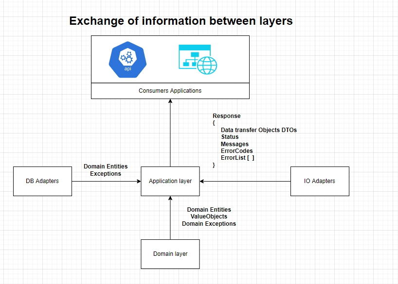
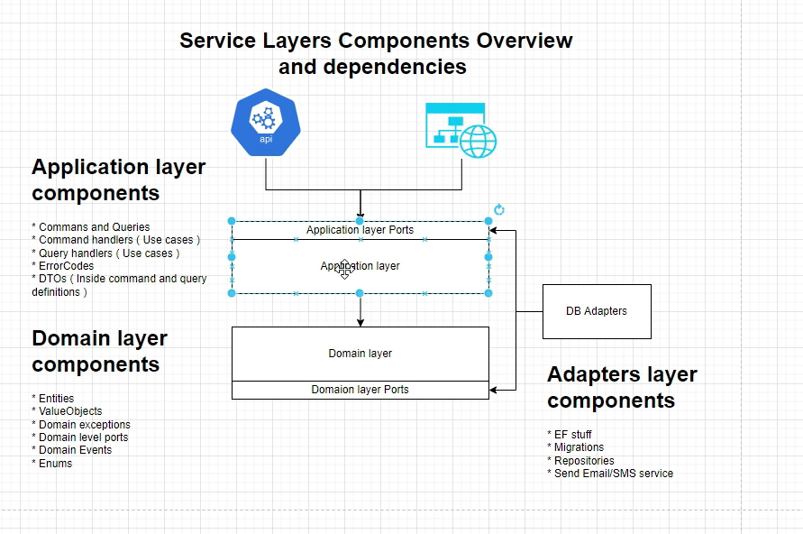

# CQRS-Hexagonal-Clean-Architecture-dotNET6

### This is a sample template project to demonstrate how to implement a services or microsservices with CQRS, Hexagonal Architecture and Clean Architecture in .NET 6.

### Indroduction
The design of this project is based on the following concepts:
- CQRS
- Hexagonal Architecture
- Clean Architecture
- SOLID
- DDD

This project is a junction of the two architectures:

    

### Example Architecture

Example of the architecture of the project:

    

Exchange of information between layers:

    

Service Layers Components Overview and dependencies:

    

